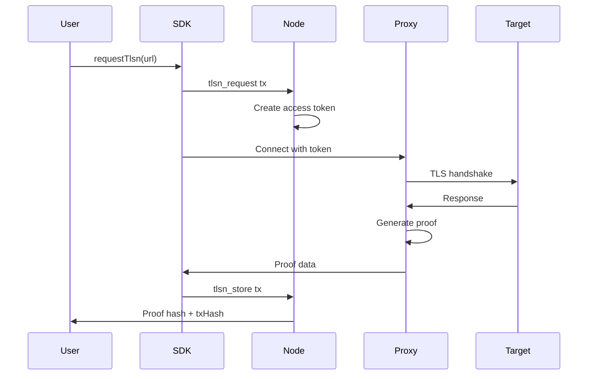

# TLSNotary

### What is TLSNotary?

TLSNotary is a cryptographic attestation system that allows you to prove the authenticity of web responses without revealing their contents to the network. Unlike DAHR (which provides fast proxied requests with hash attestation), TLSNotary generates cryptographic proofs from the TLS session itself.

### When to Use TLSNotary vs DAHR

| Feature | DAHR | TLSNotary |
|---------|------|-----------|
| **Purpose** | Fast proxied requests | Cryptographic proof generation |
| **Speed** | Fast (~500ms) | Slower (2-5s) |
| **Privacy** | Response hashes stored on-chain | Zero-knowledge proofs possible |
| **Use Case** | General API calls | Confidential data attestation |
| **Data on-chain** | Hashes of response | Proof metadata only |
| **Cost** | 1 gas | 1 DEM + gas |

**Use DAHR when:**
- Speed is critical
- You need simple hash attestation
- Data is not sensitive

**Use TLSNotary when:**
- You need cryptographic proofs of web content
- Data is confidential (financial, identity, private APIs)
- You want to prove something without revealing everything

### How It Works

1. **Request**: Submit a `tlsn_request` transaction with target URL
2. **Token**: A temporary access token is created for the proxy
3. **Proxy**: Connect to the WebSocket proxy with your token
4. **Notarization**: The proxy notarizes the TLS session
5. **Proof**: Store the proof on-chain with `tlsn_store`



### Basic Example

```typescript
import { Demos } from "@kynesyslabs/demosdk/websdk"

const demos = new Demos()
await demos.connect("https://node2.demos.sh")
await demos.connectWallet(mnemonic)

// Request TLSNotary attestation
const result = await demos.web2.requestTlsn({
    url: "https://api.example.com/private-data",
    // Optional: specify what to redact in the proof
    redactions: ["$.password", "$.secret"]
})

// The proof is automatically stored on-chain
console.log("Proof stored:", result.proofHash)
console.log("Transaction:", result.txHash)
```

### Architecture Overview

TLSNotary in Demos Network consists of:

- **WebSocket Proxy Manager**: Dynamically spawns domain-specific proxies
- **Token Manager**: Creates and validates temporary access tokens
- **Notary Service**: Performs TLS session notarization using WSTCP
- **Proof Storage**: Stores proof metadata on-chain via GCR

The system ensures that:
- Each request gets a dedicated proxy instance
- Tokens are single-use and time-limited
- Proofs are cryptographically verifiable
- Only proof metadata (not full content) is stored on-chain
