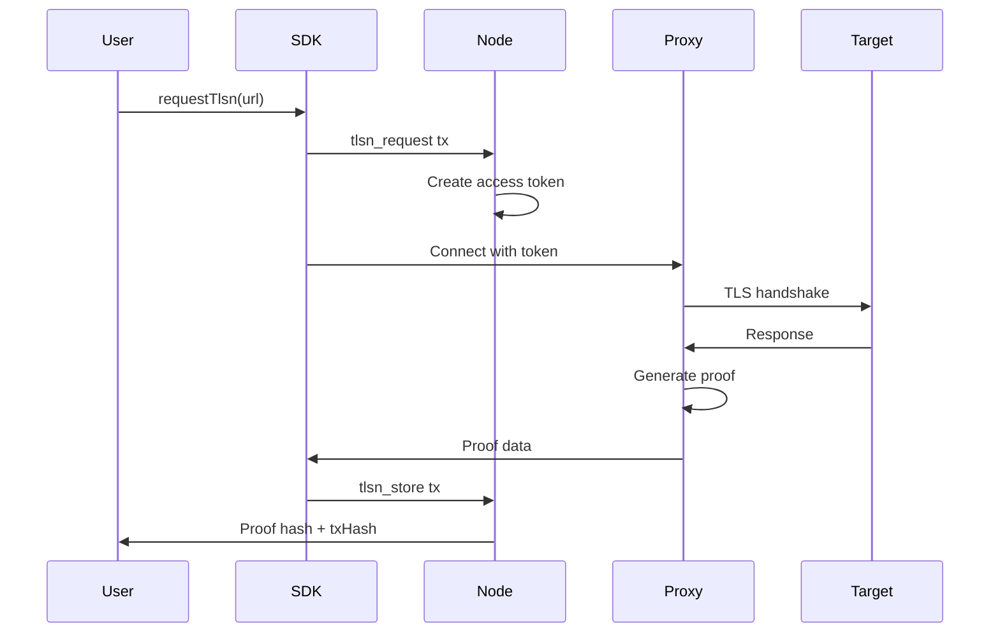

# TLSNotary

### What is TLSNotary?

TLSNotary is a cryptographic attestation system that allows you to prove the authenticity of web responses without revealing their contents to the network. Unlike DAHR (which provides fast proxied requests with hash attestation), TLSNotary generates cryptographic proofs from the TLS session itself.

### When to Use TLSNotary vs DAHR

| Feature | DAHR | TLSNotary |
|---------|------|-----------|
| **Purpose** | Fast proxied requests | Cryptographic proof generation |
| **Speed** | Fast (~500ms) | Slower (2-5s) |
| **Privacy** | Response hashes stored on-chain | Zero-knowledge proofs possible |
| **Use Case** | General API calls | Confidential data attestation |
| **Data on-chain** | Hashes of response | Proof metadata only |
| **Cost** | 1 gas | 1 DEM + gas |

**Use DAHR when:**
- Speed is critical
- You need simple hash attestation
- Data is not sensitive

**Use TLSNotary when:**
- You need cryptographic proofs of web content
- Data is confidential (financial, identity, private APIs)
- You want to prove something without revealing everything

### How It Works

1. **Request**: Submit a `tlsn_request` transaction with target URL
2. **Token**: A temporary access token is created for the proxy
3. **Proxy**: Connect to the WebSocket proxy with your token
4. **Notarization**: The proxy notarizes the TLS session
5. **Proof**: Store the proof on-chain with `tlsn_store`



### Basic Example

```typescript
import { Demos } from "@kynesyslabs/demosdk/websdk"
import { TLSNotaryService } from "@kynesyslabs/demosdk/tlsnotary"

const demos = new Demos()
await demos.connect("https://node2.demos.sh")
await demos.connectWallet(mnemonic)

// Create the service
const service = new TLSNotaryService(demos)

// Step 1: Request attestation token and get ready-to-use TLSNotary instance
const { tlsn, tokenId } = await service.createTLSNotary({
    targetUrl: "https://api.example.com/private-data"
})

// Step 2: Perform attestation
const result = await tlsn.attest({
    url: "https://api.example.com/private-data",
    // Control what's included in the proof with commit ranges
    commit: {
        sent: [{ start: 0, end: 100 }],
        recv: [{ start: 0, end: 500 }]
    }
})

// Step 3: Store proof on-chain (optional)
const storeResult = await service.storeProof(
    tokenId,
    JSON.stringify(result.presentation),
    { storage: "onchain" }
)

console.log("Proof stored:", storeResult.txHash)
console.log("Fee:", storeResult.storageFee, "DEM")
```

### Wallet Extension Integration

For production dApps, users connect via wallet extensions. The SDK provides `WithConfirmation` methods that implement the 3-step wallet flow:

1. **Generate Transaction**: Create the transaction
2. **Sign & Confirm**: User approves in wallet extension
3. **Broadcast**: Send to network

```typescript
import { TLSNotaryService } from "@kynesyslabs/demosdk/tlsnotary"

const service = new TLSNotaryService(demos)

// With user confirmation for wallet extension apps
const { tlsn, tokenId } = await service.createTLSNotaryWithConfirmation(
    { targetUrl: "https://api.example.com/data" },
    {
        onConfirm: async (details) => {
            // Show modal: "Burn 1 DEM for attestation?"
            return await walletExtension.requestApproval(details.transaction)
        }
    }
)

const result = await tlsn.attest({ url: "https://api.example.com/data" })

await service.storeProofWithConfirmation(
    tokenId,
    JSON.stringify(result.presentation),
    { storage: "onchain" },
    {
        onConfirm: async (details) => {
            // Show modal: "Burn 6 DEM to store proof?"
            return await walletExtension.requestApproval(details.transaction)
        }
    }
)
```

### Architecture Overview

TLSNotary in Demos Network consists of:

- **WebSocket Proxy Manager**: Dynamically spawns domain-specific proxies
- **Token Manager**: Creates and validates temporary access tokens
- **Notary Service**: Performs TLS session notarization using WSTCP
- **Proof Storage**: Stores proof metadata on-chain via GCR

The system ensures that:
- Each request gets a dedicated proxy instance
- Tokens are single-use and time-limited
- Proofs are cryptographically verifiable
- Only proof metadata (not full content) is stored on-chain
